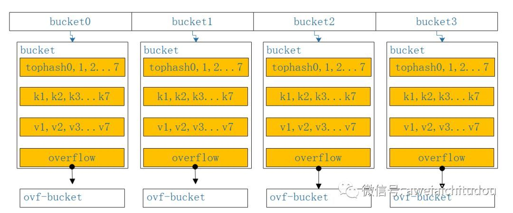
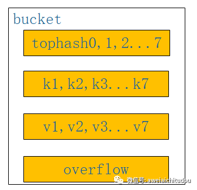
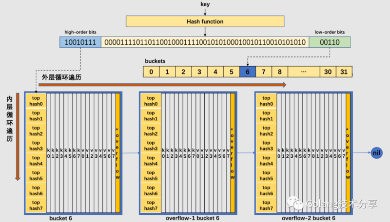

## 字典map

1. <https://www.fatalerrors.org/a/a-comprehensive-analysis-of-golang-s-map-design.html>
2. <https://cloud.tencent.com/developer/article/1468799>
3. <https://studygolang.com/articles/19219?fr=sidebar> 最全源码讲解
3. https://hackernoon.com/some-insights-on-maps-in-golang-rm5v3ywh 国外一个讲的比较好的

## 一些常见问题

1. map不能并发读写！！！会报错！！！**（致命级别的问题）**
1. 注意，golang里面的默认的map的初始大小是一个bucket

### 数据结构

#### hmap（map的结构）

```
// map 哈希表
type Hmap struct{
         count int // 元素数量
         ....
         B uint8 // 哈希表数组的容量大小=2^B
         noverflow uint16 // 溢出桶的总数（估计值）
         ...
         buckets unsafe.Pointer
         oldBuckets unsafe.Pointer // 用于扩容
         ...
}
```

那个buckets的指向的数组结构如下：



#### bmap （bucket结构）

```      
// A bucket for a Go map.
type bmap struct {
    // 每个元素hash值的高8位，如果tophash[0] < minTopHash，表示这个桶的搬迁状态
    tophash [bucketCnt]uint8
    // 接下来是8个key、8个value，但是我们不能直接看到；为了优化对齐，go采用了key放在一起，value放在一起的存储方式，
    // 再接下来是hash冲突发生时，下一个溢出桶的地址
}
```



### 索引

golang map的所有操作都会先涉及到索引，这里map的索引分为两步：

1. 首先是确定是哪个桶，这个是通过`bucket := hash & bucketMask(h.B)`，来实现。那个hash就是前面用散列函数生成的一个hash值，**然后注意！这里是通过位运算（bucketMask其实就是00...111），而且取的是hash值的低B位的（不一定是低8位！！！）值作为下标来确定时哪个桶**
2. 其次是确定桶里面是哪一个kv对，这个是用hash值的**高八位**跟桶里面的tophash数组里面的值循环比对，具体过程见相应的操作，但总体各个操作在这一步也没啥区别

### 插入/更新（这个第二篇文章说了）

编译器会将map的插入/更新操作转换为runtime.mapassign

golang中的map的插入和索引。解决hash冲突的方式是**线性探测+拉链法**

1. tophash初始化时里面的值都是emptyRest。当插入/更新一个keyA时，keyA经过hash后的高八位会在tophash数组里面循环比对，找到emptyRest的地方存储。
2. 如果比对成功（说明之前有相同hash值的key存在这里了，可能就是这个key，也可能是别的发生碰撞的key），这个时候用指针运算把这个位置已经存过的key取出来和keyA比较，相等就说明没有碰撞（取出来的key就是keyA），直接更新对应的value。如果不想等就说明这个key发生碰撞，继续1，找emptyReset的地方存储

```go
b := bucket
top := hashtop8(key)
loop:
for {
  for i := 0; i < bucketCnt; i++ {
    if b.tophash[i] != top { // 要么这个位置是空，要么是别的key
      if 这个位置是空 {
        插入key和value
        break loop
      } 
      continue // 别的key
    } 
    // 要么是已经存在key更新，要么是碰撞了
    if 碰撞了 {
      continue
    } 
    更新对应的value
  }
  b = b.overflow
}
.......
把top存储进tophash，新建桶再插入（这个是没找到emptyReset的时候）的操作都在for外面，loop里面
```

### 查找（这个第一篇文章讲得好）

编译器会将索引转换为runtime.mapaccess1&2（1是返回1个参数，2是返回两个参数）

1. 当索引一个keyA时，keyA经过hash后的高八位会在tophash数组里面循环比对。
2. 如果比对成功，用指针运算把这个位置已经存过的key取出来和keyA比较，相等说明没有碰撞，直接把value返回出去。不相等说明发生碰撞了，继续线性探测，重复2，循环完了就进入overflow，一直到overflow都走完。在每个bucket的tophash里面是**线性探测**，overflow是**拉链法**
3. 如果没比对成功，并且把overflow都走过一遍了，说明没有，则返回

```go
b := bucket
top := hashtop8(key)
bucketloop:
    for ; b != nil; b = b.overflow(t) {
        for i := uintptr(0); i < bucketCnt; i++ {
            if b.tophash[i] != top { // 要么这个位置是空，要么是别的key
                if 这个位置是空的 { // 这个位置是空的，跳转到最后返回0值
                    break bucketloop
                }
                continue // 别的key
      			}
         		k := 提取i这个位置上的key
            if k == key { // 相等说明就是这个key
							return 对应的value
            }
        }
    }
  // If all bucket s are not found, zero is returned
    return unsafe.Pointer(&zeroVal[0])
}
```




### 删除

删除就一点需要注意：golang傻逼的map自己浪费了内存（注意不一定是内存泄漏，内存泄漏专指在堆上的动态内存）

#### mapdelete里面的具体操作是这样的：

- 当这个被删除的key不是当前桶（包括溢出桶）里面的最后一个有效key时，则只置emptyOne标志（这个是tophash里面存的值），该位置对应的key和value被置为各自类型的0值。但并未被删除kv（如果是指针，那么指针指向的内存被清空了，指针还在那），后续插入操作不能使用此位置
- 如果只剩最后一个有效节点了也被删除了，则把桶里面所有标志为emptyOne的位置，都置为emptyRest（这个也是tophash里面存的值）。置为emptyRest的位置可以在后续的插入操作中被使用。

其实就是说delete是个软删除，只是把这个位置置为“不可操作”，然后把它们置为各自类型的0值，并不真正删除存储的kv对。最后到达一定条件后统一清理，**但是当删除一个kv的时候len是变化的！！！**

#### 为什么这么做：

**这种删除方式，以少量空间来避免桶链表和桶内的数据移动。事实上，go 数据一旦被插入到桶的确切位置，map是不会再移动该数据在桶中的位置了。**

#### 内存浪费

那么这个删除模式会导致一种情况，就是每个桶里面只有一个数据，造成了很大的空间浪费了，想想map只增不减情况，这时候就需要缩容了。go里面也有缩容判断，不过这个缩容是伪缩容

### map 的遍历无序性

map遍历（for range）是无序的，原因如下：<https://www.jianshu.com/p/2fd7064bbe44>

```go
for k, v := range m { // original body
}
// 上面的代码被编译器转换成下面的语句
var hiter map_iteration_struct
for mapiterinit(type, range, &hiter); hiter.key != nil; mapiternext(&hiter) {
    index_temp = *hiter.key
    value_temp = *hiter.val
    index = index_temp
    value = value_temp
    // original body
}
```

简单来说就是开始迭代map的时候，每次开始都做了随机播种。但一定要注意 **随机播种发生在mapiterinit里面，mapiternext没有随机**。具体来说就是先随机选取一个bucket作为起始bucket（注意之后依次迭代bucket，数组完了就从头开始到当前位置），然后在这个bucket里面根据offset找一个起始元素开始迭代（注意之后每个bucket的起始元素都从这个offset开始），**所以map并不是真正意义上的满足某种分布的随机，只是每次的起始点不同（不同的起始bucket和起始元素）**

```go
func mapiterinit(t *maptype, h *hmap, it *hiter) {
    ...
    r := uintptr(fastrand())
    if h.B > 31-bucketCntBits {
        r += uintptr(fastrand()) << 31
    }
  	it.startBucket = r & bucketMask(h.B) // 这个是数组中随机找一个bucket作为起始
    it.offset = uint8(r >> h.B & (bucketCnt - 1)) // 这个是在bucket中随机找一个元素作为起始（注意这里没有新生成一个数吗，而是直接用的r）
    ...
}
func mapiternext(it *hiter) {
    ...
  	bucket := it.startBucket // 起始bucket
    for ; i < bucketCnt; i++ {
      	offi := (i + it.offset) & (bucketCnt - 1) // 起始元素
        ...
    }
}
```

### 扩容

注意：扩容是需要rehash的，也就是要调整所有kv的位置的

https://studygolang.com/articles/31091

#### 负载因子

负载因子=元素数量/数组大小，redis是1时扩容，golang是6.5（因为数组里面装的是bucket，所以可以大于1），如果负载因子越大，则说明空间使用率越高，但产生哈希冲突的可能性更高。

#### 什么时候扩（缩）容

哈希表在赋值（存储/更新）的动作下会触发扩（缩）容行为

```
if !h.growing() && (overLoadFactor(h.count+1, h.B) || tooManyOverflowBuckets(h.noverflow, h.B)) {
    hashGrow(t, h)
    goto again
}
```

触发条件如下：

- 触发 `load factor` 的最大值，负载因子已达到当前界限（这个触发翻倍扩容，保证长度是2的幂）

  这里注意扩容因子（load factor）是6.5，即kv对个数（**包括delete的kv对**）大于数组中bucket个数（不包括overflow）大于6.5

- 溢出桶 `overflow buckets` 过多（这个触发等量扩容，即伪缩容）

  注意这里的溢出桶指的是溢出桶总数（hmap里面的noverflow），过多指的是溢出桶总数大于（1<<15），这个缩容只是为了让存储更紧密，因为溢出桶太多说明“碰撞”太多需要rehash

#### 扩容过程trick

1. 增量渐进扩容（跟redis类似）

2. 迁移时支持读写（如何支持如下）

   + 新增kv只写新表

   + 修改和删除双写，保证新老表中的数据一致

   + 读取时优先读老表，再读新表（注意搬迁是复制，而不是剪切，因此老表新表上会有很多重复的）

4. delete和赋值操作都会触发搬迁，每次搬迁2个bucket

   + 修改的key所在的当前Bucket

   + 按照顺序搬迁的一个Bucket（避免某些bucket一直未被访问导致无法搬迁成功）

5. 直到所有数据搬迁完成后，删除hmap里面那个oldBuckets，使得老哈希表被GC回收

##### 为什么增量扩容

全量扩容会卡顿，增量扩容会通过每次map操作去分摊扩容的操作

### 设计Trick

+ 为啥bucket里面kv分开存，因为你去想一个array，如果你一个array里面既有k又有v，你就得对齐，但是如果你用两个array一个存k，一个存v，就自己对齐就行了
+ 其实用Bucket并不只是用来实现碰撞后的线性探测+拉链法的。还可以减少对象数量，有利于提升GC性能
+ 注意一般不用hash+取模来确定存储位置，而是会用hash+位运算来确定。而位运算的那个算法要求了hashMap的长度必须是2的幂，才能保证各个位置的概率均匀（而且一般起步都是16，因为一般位运算都是hash值 & (length-1)）。<https://zhuanlan.zhihu.com/p/31610616>


### 使用trick

1. map添加索引

 + 如果map是nil，直接map[k] = t，会报panic的

2. map索引

 + 和slice一样，针对map类型的nil的迭代是可以的